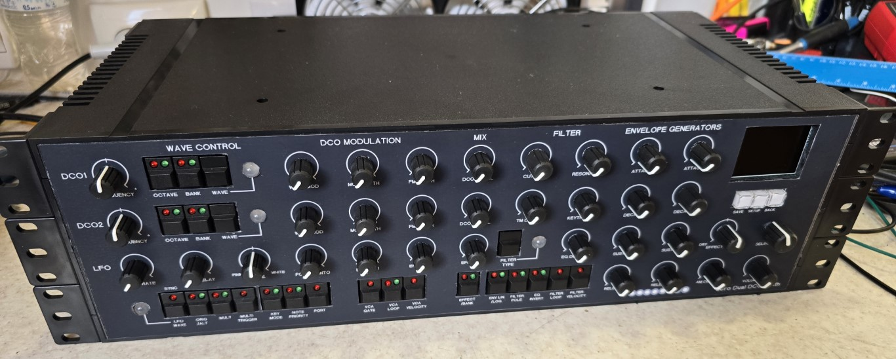

# Poly-Zero-8-voice-Polysynth
Based on the Hagiwo $9 DCO and the Polykit 16 filter cards

Completed Synth, taking the earlier Seeed XIAO RP2040 dual oscillator monosynth and creating an 8 voice Polysynth based on this but using Waveshare Zero RP2040 instead the Seeed. The DCO's are further modified to use MIDI for notes instead of the CV input on the ADC and because you now have 4 ADC's on the Waveshare you can add FM, wave MOD, Tuning and pitchbend all as seperate inputs. The Octave, wave bank, wave form selection is now done over MIDI as CC messages and it has an added glide function, the time and on/off functions are again sent as CC messages.

The FX board and a new menu system has been created to display groups of parameters within a module such as LFO, DCO1, DCO2, Filter, ADSR etc.

Things to do

Fix PB Range from 1 tone to 1 octave in the menus

